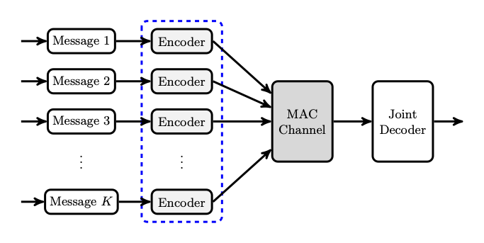

# Large-scale Coded Computing

Coded distributed matrix multiplication for straggler mitigation has received a lot of attention recently.
In coded distributed matrix multiplication, a master node wishes to compute the matrix product $$A^TB$$ with the help of several worker nodes.

The realization by the research community that resource allocation through individualized feedback can only offer partial answers to the challenges of tomorrow is evinced by a recent propensity by scholars to look for alternate paradigms.
The revival of random access for wireless systems exemplifies the need to address the sporadic and uncoordinated nature of machine-driven communications.
This departure from established solutions also points at the difficulty of facilitating the transmission of short payloads, as opposed to sustained connections.
Small packets akin to those generated by sensors and IoT devices lead to transient data transfers.
This precludes the type of amortization described above whereby spectral resources are spent with the goal of maintaining long connections.
Another prime aspect of emerging wireless traffic pertains to resolving the identities of active devices.
When the number of devices within an area becomes very large, with only a subset of them being active at any point in time, the problem of allocating resources (e.g., codebooks, subcarriers, signature sequences) to every user in order to manage interference becomes excessively complex. 
Since devices are unaware of who else is in the active set, they cannot apportion resources to themselves in a distributed fashion. 
Here again, a more centralized solution with detailed feedback is impractical.
This forces active users to act in an uncoordinated fashion or, from an information theoretic perspective, to use identical codebooks.
This constraint substantially complicates the design of computationally-efficient decoding algorithms that offer good performance.
When the number of devices within a cell is huge and the set of active devices changes rapidly, the task of repetitively resolving identities through decoding becomes insurmountable.
Despite this reality, several IoT access schemes found in the literature assume that each device uses its own prescribed codebook.
Implicitly, this is equivalent to the access point being aware of who is transmitting, with every device being assigned a specific encoder.
Consequently, established sourced paradigms for wireless access are inadequate for MTC traffic; prior work on random and multiple access is vast, inspirational, yet inapplicable without substantial modifications to the problem at hand.
As we will see, this challenge can be addressed by leveraging the inherent sparsity in the low activity factor within a large IoT device population.

