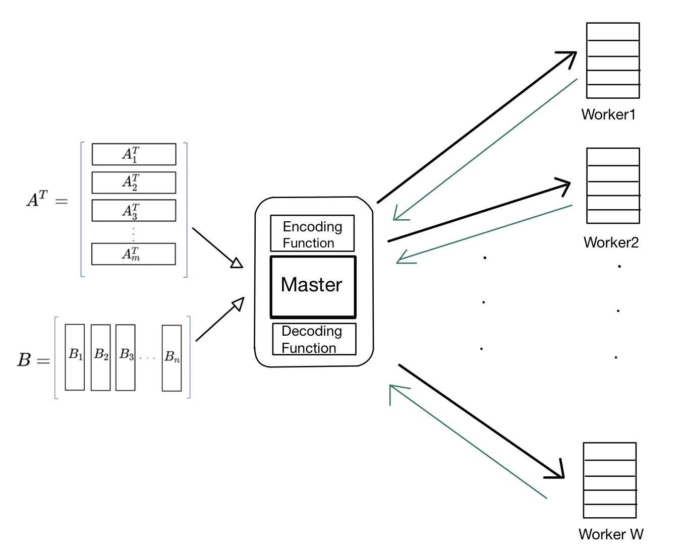

# Large-scale Coded Computing

Many applications in optimization and machine learning require multiplications of large matrices of dimension of the order of 10^5X10^5. 
These large-scale matrix multiplications cannot be carried out in a single machine mainly due to low-latency requirement in many applications. 
So, in order to meet this requirement, people proposed coded distributed matrix multiplication for straggler mitigation.
In coded distributed matrix multiplication, a master node wishes to compute the matrix product $$A^TB$$ with the help of several worker nodes. (As shown in the figure)
The main idea is to partition $$\mb{A}$$ and $$\mb{B}$$ into several smaller submatrices, encode the submatrices using a carefully constructed code into a redundant set of submatrices, and transmit the encoded submatrices to different worker nodes. 
The worker nodes compute the smaller matrix products and return their computation to the master node which combines the results from each worker node to produce the final result.
The code is designed such that the final result can be recovered from a subset of the submatrix products, i.e., the system is resilient to straggling workers which do not return their computation in time. 
Recovery threshold of this algorithm defined as the minimum number of worker nodes that the master node needs to wait for to compute two large matrices.

Robust algorithms for such kind of large-scale distributed matrix multiplication need to address several important factors including 

(i) resilience to straggling workers, typically measured using a recovery threshold, which is the minimum number of workers that need to return their computation; 

(ii) communication cost - the amount of information that needs to be communicated to the worker nodes; 

(iii) scalability - the numerical accuracy and implementation complexity of the distributed algorithms.

In this work, we proposed several encoding schemes. 
* Product Lagrange (PLCC)codes, which is a variant of the LCC scheme by combining ideas from classical product codes and LCC. The main advantage of PLCC is that they are more numerically stable than LCC; however, their resilience to stragglers is sub-optimal.
* Factored LT (FLT)codes, which is based on LT codes, have a near-optimal recovery threshold when the number of worker nodes is very large.
* Random Khatri-Rao-Product(RKRP) codes, which is highly numerically stable in decoding.